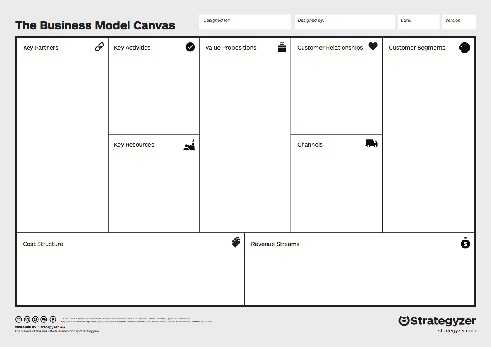
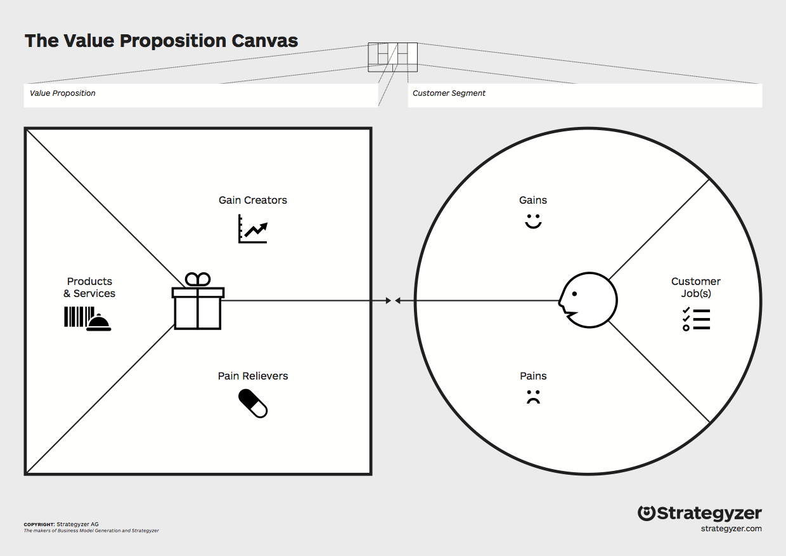

# Identity

As we said in the introduction, we're defining an organization generally as an economic entity larger than an individual. But what sets your organization apart from any other? In this chapter we'll look at two ways to define your organization's collective self-identity. We'll start with your *internal* identity: your mission, vision, and values. Then we'll talk about your *external* identity as you relate specifically to  customers and partners—namely, your business model.

## Mission, Vision, and Values

A mission is a verb. It's something you do.

A vision is a noun. It's something you see.

Values are rules of thumb, touchstones you refer to when making difficult decisions.

## Business Model

Your business model is your plan for *sustainably* pursuing your mission, in service of your vision, according to your values. Your mission, vision, and values are about your organization's core identity, your internal center, if you will. Your business model is where you turn outwards: Who are your customers? What do they need and want? How are you going to serve them? Who will partner with you?

Strageyzer's [Business Model Canvas](http://businessmodelgeneration.com/canvas/bmc) and [Value Proposition Canvas](http://businessmodelgeneration.com/canvas/vpc) are the best place to start in wrapping your head around what a business model is and how to develop one. Go watch the videos at those links; here's what the canvases look like:

When you have your 